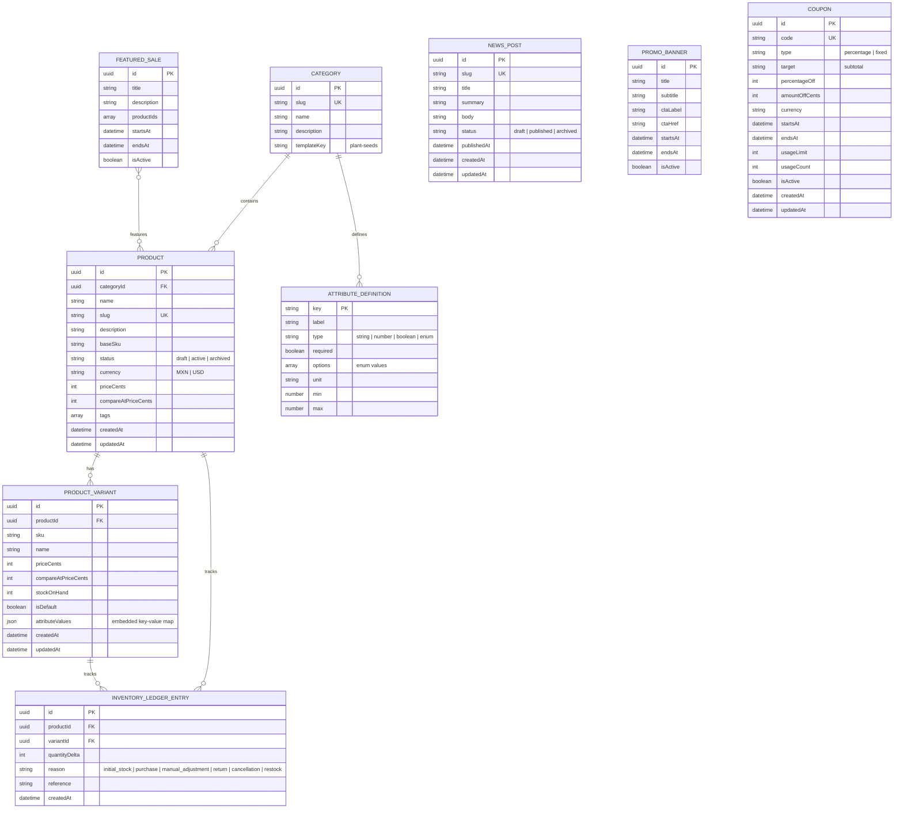

# Domain ERD and Schema Notes

## Persistence model

The project uses two persistence strategies:

- **Relational (Cloudflare D1 + Drizzle)**: users, accounts, auth tokens, carts, and refresh sessions.
- **Runtime in-memory store**: categories, products, variants, inventory, content (news, banners, featured sales), coupons, and orders. Data is rebuilt from seed fixtures on every deploy/restart and managed in memory by the admin service.

---

## ERD — Persisted tables (D1)

```mermaid
erDiagram
  USER ||--o{ ACCOUNT : has
  USER ||--o{ VERIFICATION_TOKEN : owns
  USER ||--o{ PASSWORD_RESET_TOKEN : owns
  USER ||--|| CART : has
  USER ||--o{ AUTH_REFRESH_SESSION : has
  CART ||--o{ CART_ITEM : contains

  USER {
    text id PK
    text name
    text email UK
    integer emailVerified
    text image
    text role "owner | manager | catalog"
    text passwordHash
    integer createdAt
    integer updatedAt
  }
  ACCOUNT {
    text userId FK
    text type
    text provider PK
    text providerAccountId PK
    text refresh_token
    text access_token
    integer expires_at
    text token_type
    text scope
    text id_token
    text session_state
  }
  VERIFICATION_TOKEN {
    text identifier PK
    text token PK
    integer expires
  }
  PASSWORD_RESET_TOKEN {
    text token PK
    text userId FK_UK
    integer expires
    integer createdAt
  }
  CART {
    text id PK
    text userId FK_UK
    integer createdAt
    integer updatedAt
  }
  CART_ITEM {
    text cartId PK_FK
    text variantId PK
    text productId
    text name
    text variantName
    text href
    text currency
    integer unitPriceCents
    integer stockOnHand
    integer quantity
    text unavailableReason
    integer updatedAt
  }
  AUTH_REFRESH_SESSION {
    text id PK
    text userId FK
    text surface "storefront | admin"
    text tokenHash UK
    text deviceId
    text userAgent
    text ipHash
    integer createdAt
    integer lastSeenAt
    integer idleExpiresAt
    integer absoluteExpiresAt
    integer revokedAt
    text rotatedFromId
  }
```

---

## ERD — Runtime domain entities (in-memory store)

These entities are validated by Zod schemas in `packages/domain/` and managed in the runtime store. They are **not** persisted in D1.



---

## Role model

- `owner`: full platform permissions (all 8 permissions). Can access admin routes.
- `manager`: catalog/content/orders operations, no role management. Can access admin routes.
- `catalog`: catalog + inventory operations, read-only content. **Cannot access admin routes** (admin layout requires `owner` or `manager` role).

### Permission matrix

| Permission       | owner | manager | catalog |
| ---------------- | :---: | :-----: | :-----: |
| catalog:read     |   ✓   |    ✓    |    ✓    |
| catalog:write    |   ✓   |    ✓    |    ✓    |
| inventory:adjust |   ✓   |    ✓    |    ✓    |
| content:read     |   ✓   |    ✓    |    ✓    |
| content:write    |   ✓   |    ✓    |    —    |
| orders:read      |   ✓   |    ✓    |    —    |
| orders:write     |   ✓   |    ✓    |    —    |
| roles:manage     |   ✓   |    —    |    —    |

---

## Seeded attribute template set

- `plant-seeds`

Uses typed attributes (`string`, `number`, `boolean`, `enum`) validated by the shared attribute engine.

## Store profile contract

- Runtime storefront data is constrained to the active `STORE_PROFILE`.
- Allowed value: `plant-seeds`
- Default profile for local/dev fallback: `plant-seeds`.
